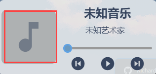
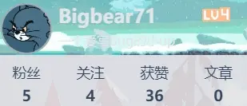

# DWidgets

## 目录

- [背景](#背景)
- [使用](#使用)
- [组件介绍](#组件介绍)
- [其他](#其他)

## 背景

### DWidgets是一款桌面组件软件，因为Windows自带的小组件有点拉，所以决定自己做一个，布局参考[SwetyCore](https://github.com/SwetyCore)大佬的[VueWidgets](https://github.com/SwetyCore/VueWidgets)

## 使用

### 窗体
使用快捷键 Alt + D 唤醒

### 工具栏
使用快捷键 Alt + T 唤醒  

  

功能
1. 移动窗体
2. 复位
3. 设置
4. 更改组件位置
5. Bing搜索框

### 设置

## 组件介绍
以下是已实现的组件和后期可能会加入的组件
|项目|进度|
|:---:|:---:|
|时钟|✔️|
|倒计时(日期)|✔️|
|课程表|✔️|
|代办|✔️|
|倒计时(分秒)|✔️|
|音乐播放器|✔️|
|BiliBili用户小卡片|✔️|
|快捷控制|✔️|
|便签|✔️|
|硬盘&内存 占用显示|✔️|
|浏览器搜索框|✔️|

### 时钟
功能
* 时分秒
* 年月日
* 星期

### 倒计时(日期)
功能
* 距离 xxx事 xxx天
* xxx事结束时间

### 课程表
功能
* 列出一天的课程
* 包括上课时间、下课时间、学科、老师

其他
* 课程需要在 设置页面 设置

### 代办
功能
* 添加代办
* 删除代办
* 清空代办

### 倒计时
功能
* 倒计时(最高60分钟)

### 音乐播放器
功能
* 播放/暂停 音乐
* 快进/后退
* 歌曲信息

其他
* 点击音符图标可以选择音频文件

### BiliBili用户小卡片
功能
* 显示用户基本信息
1. 头像
2. 名称
3. 签名
4. 等级
5. 粉丝数
6. 关注数
7. 获赞
8. 文章

其他
* 左键点击卡片刷新信息
* 右键点击卡片登录
* 卡片背景图会随系统时间改变

### 快捷控制
功能
* 锁屏
* 打开 系统Explorer
* 打开 系统计算器
* 打开 组件-便签

### 便签
功能
* 富文本编辑

其他
* 目前只能通过组件 [快捷控制](#快捷控制) 打开

### 内存/硬盘 数据显示
功能
* 显示 总内存
* 显示 已用内存
* 显示 可用内存
* 显示 内存使用率
* 显示 所有硬盘
* 显示 硬盘总空间
* 显示 硬盘可用空间

其他
* 点击硬盘卡片可打开对应硬盘
## 其他

最后感谢你使用这款软件，目前只有些简单的功能，后期将会持续更新，加入更多组件  
如有建议或bug反馈,可以联系我的QQ [2570134648](http://wpa.qq.com/msgrd?v=3&uin=2570134648&site=qq&menu=yes)